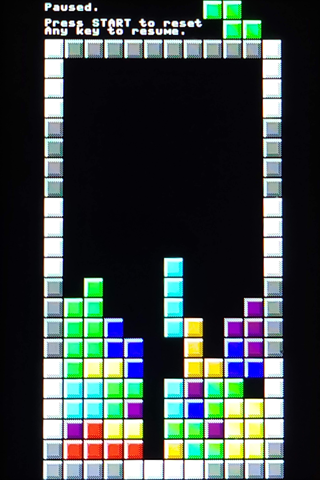

# testris
A MicroPython game to test display drivers

I needed a concrete example of how [generic display drivers in MicroPython](https://github.com/bdbarnett/mpdisplay) might be used.  This game uses 10 buffers to hold the graphics representation of 10 color blocks and 1 buffer that is reused to show the text at the bottom of the splash screen and a banner at the top of the play screen showing score and messages.

 `touchpad.py` is a simple support class that takes in a touchscreen driver and outputs a number from 1 to 9 when read by dividing the screen into a 3 x 3 grid.

